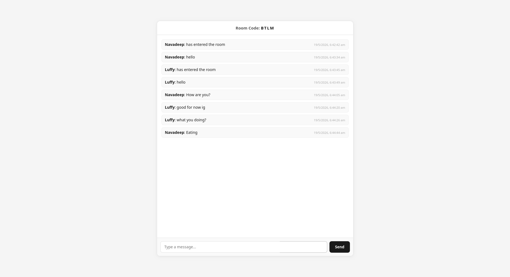

# Mind Meld
A Flask Chat App

A real-time chat application built with Flask and SocketIO. Create or join rooms and chat instantly.

## Screenshots




## Features

- Create and join chat rooms with unique codes
- Real-time messaging with SocketIO
- Multiple users per room
- Clean minimal UI

## Stack

- Python + Flask
- Flask-SocketIO
- HTML/CSS
- Jinja2

## Run locally

```bash
pip install flask flask-socketio
python app.py
```

App runs on `http://localhost:5000`
